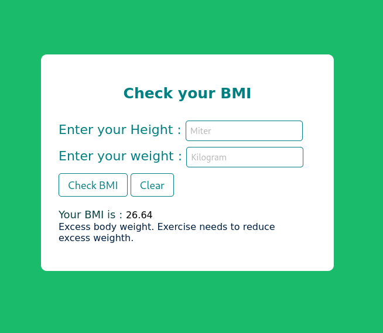
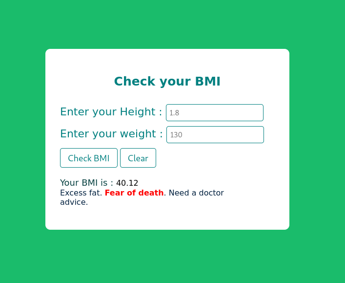

<h1>That is a simple calculator of Body mass index</h1>

<h2>About</h2>

Body mass index is a value derived from the mass and height of a person. The BMI is defined as the body mass divided by the square of the body height, and is expressed in units of kg/m², resulting from mass in kilograms and height in metres. 

 

 
