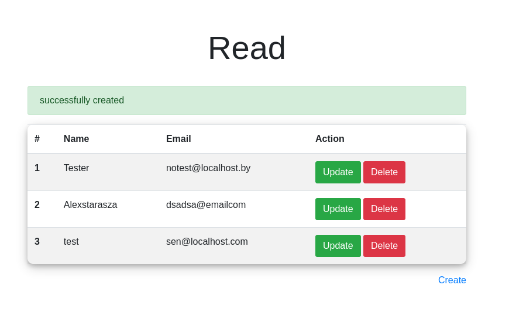
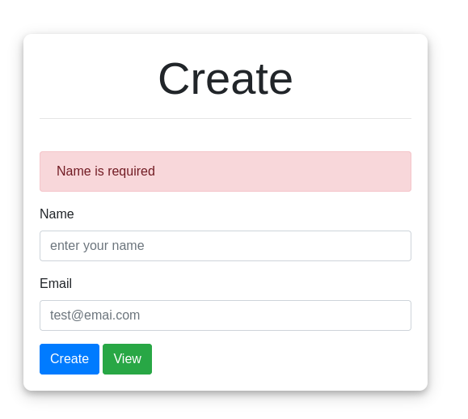

# CRUD application

## About
Basic functions such as *CREATE, READ, UPDATE, DELETE* have been implemented in this application.\
Some validation checks have also been performed.\
The application has been successfully adopted for [best](https://www.infinityfree.net/) hosting and runs 24/7 on the web.\
[Try it for free](http://myphpcrud.epizy.com) - **myphpcrud.epizy.com**
## Screenshots:

 

